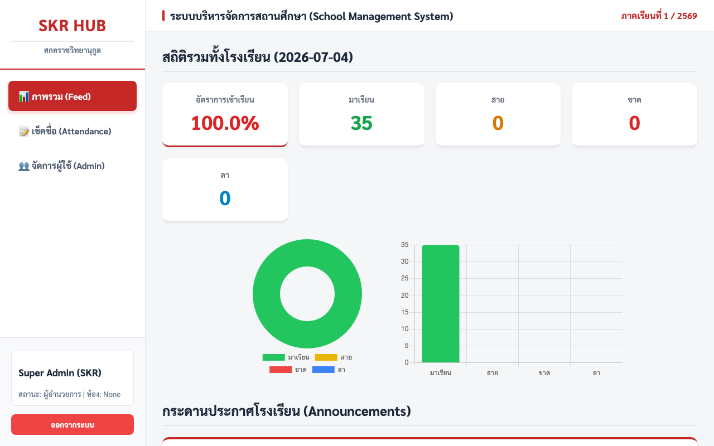
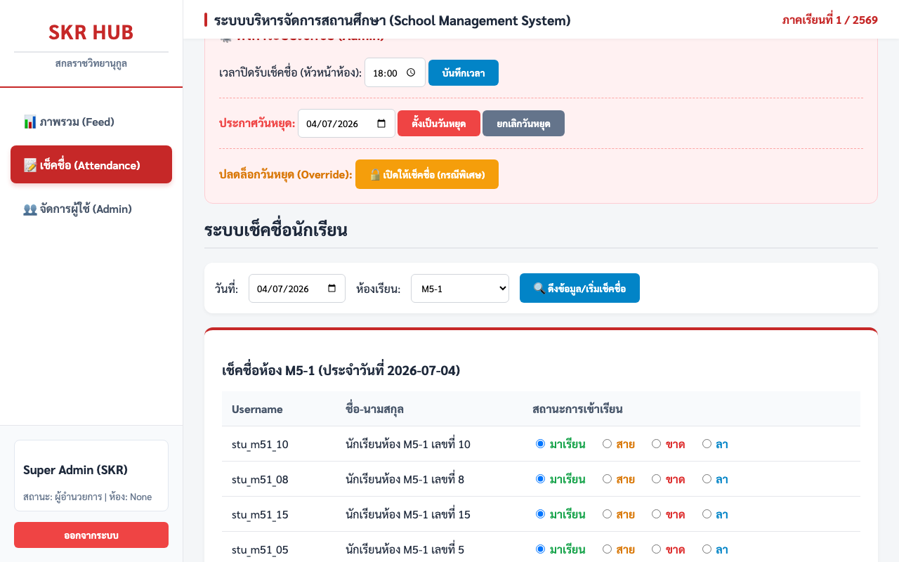
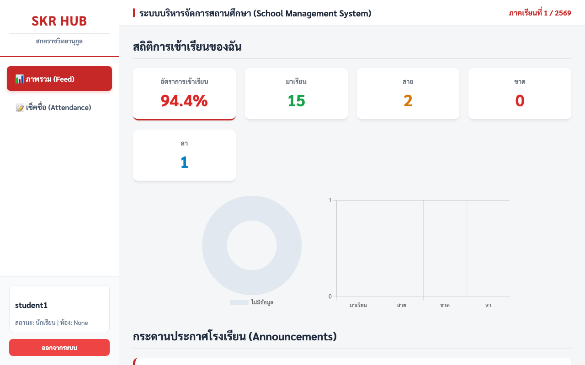
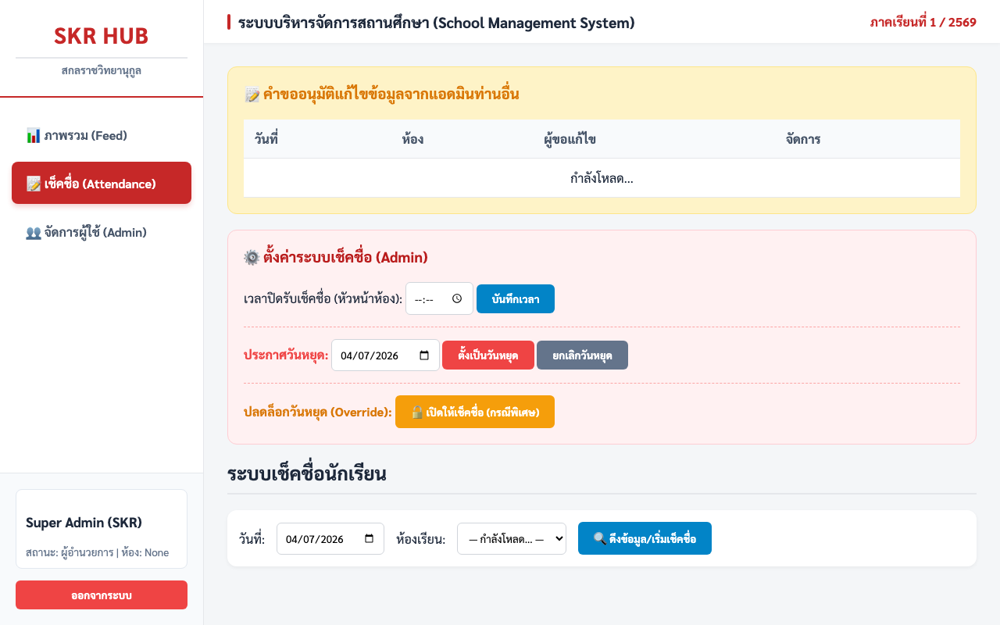
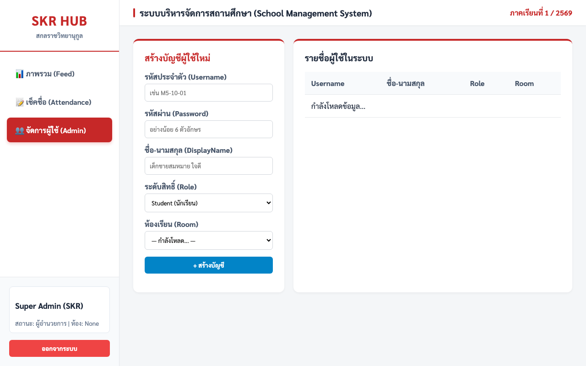

# 📘 คู่มือการใช้งานระบบ SKR School Management System (SKR-SMS)

ระบบ **SKR-SMS** เป็นระบบสารสนเทศสำหรับการบริหารจัดการการเข้าเรียน (เช็คชื่อ) และการกระจายข่าวสารภายในโรงเรียน โดยออกแบบมาให้ใช้งานง่าย รวดเร็ว และรองรับผู้ใช้งานจำนวนมากพร้อมกัน

---

## 👥 ระดับสิทธิ์ของผู้ใช้งาน (User Roles)
ระบบถูกออกแบบมาให้มีผู้ใช้งาน 4 ระดับ เพื่อจำกัดขอบเขตการเข้าถึงข้อมูลให้ปลอดภัยที่สุด ดังนี้:

1. 👑 **Super Admin (ผู้ดูแลระบบสูงสุด)**
   - เปรียบเสมือนผู้อำนวยการหรือฝ่าย IT หลัก
   - **สิทธิ์:** เข้าถึงได้ทุกเมนู สร้างบัญชีผู้ใช้ได้ทุกระดับ, กำหนดวันหยุด, กำหนดเวลาปิดรับเช็คชื่อ, และเป็นผู้อนุมัติคำขอแก้ไขข้อมูลย้อนหลัง

2. 👩‍🏫 **Admin (ครู / ฝ่ายวิชาการ)**
   - เปรียบเสมือนครูประจำชั้น หรือฝ่ายบุคคล
   - **สิทธิ์:** สร้างบัญชีนักเรียนและหัวหน้าห้อง, โพสต์ประกาศข่าวสาร, เช็คชื่อนักเรียนได้ **ทุกห้อง**, และสามารถ "ส่งคำขอ" แก้ไขการเช็คชื่อย้อนหลังได้ (ต้องรอ Super Admin อนุมัติ)

3. 🧑‍✈️ **Head Student (หัวหน้าห้อง)**
   - เปรียบเสมือนตัวแทนของห้องเรียน
   - **สิทธิ์:** เข้าสู่ระบบเพื่อทำการเช็คชื่อ (มา/ขาด/สาย/ลา) ให้กับเพื่อนๆ **เฉพาะในห้องของตัวเองเท่านั้น** ไม่สามารถก้าวก่ายห้องอื่นได้ และสามารถรับอ่านข่าวสารได้

4. 🎒 **Student (นักเรียนทั่วไป)**
   - **สิทธิ์:** เข้าสู่ระบบเพื่ออ่านประกาศข่าวสารจากทางโรงเรียน และสามารถ **ดูประวัติการเข้าเรียนของตนเองย้อนหลังได้** เท่านั้น (ไม่มีสิทธิ์เช็คชื่อให้ใครทั้งสิ้น)

---

## 🚀 ฟังก์ชันการทำงานหลัก (Core Features)

### 1. 📊 กระดานข่าวสารแบบเรียลไทม์ (Real-time Feed)
ระบบกระดานข่าวกลางที่ช่วยให้การสื่อสารในโรงเรียนฉับไว
* **สำหรับแอดมิน:** สามารถพิมพ์ข้อความและกด "โพสต์ประกาศ" ได้ทันที
* **สำหรับนักเรียน/หัวหน้าห้อง:** เมื่อแอดมินกดโพสต์ ประกาศนั้นจะ **เด้งขึ้นบนหน้าจอของนักเรียนทุกคนทันที** โดยที่นักเรียนไม่ต้องกดรีเฟรชหน้าเว็บ (รวดเร็วเหมือนการส่งข้อความแชท)

### 2. 📝 ระบบเช็คชื่อ (Attendance System)
ระบบเช็คชื่อที่ออกแบบมาให้หัวหน้าห้องหรือครูทำรายการได้ง่ายที่สุด
* **วิธีการใช้งาน:** 
  1. ไปที่เมนู "เช็คชื่อ"
  2. เลือกวันที่ต้องการ (โดยปกติระบบจะตั้งเป็นวันปัจจุบันให้)
  3. เลือกห้องเรียน (ถ้าเป็นหัวหน้าห้อง ระบบจะล็อกห้องให้เลยเพื่อป้องกันการเช็คชื่อผิดห้อง)
  4. กด **"ดึงข้อมูล"** รายชื่อนักเรียนทั้งหมดในห้องจะปรากฏขึ้นมา
  5. ติ๊กสถานะให้เพื่อนแต่ละคน (มา / ขาด / สาย / ลา)
  6. กด **"ยืนยันการบันทึกข้อมูล"**
* **ความปลอดภัย:** ระบบจะไม่อนุญาตให้กดเช็คชื่อซ้ำซ้อน และมีระบบล็อกไม่ให้เช็คชื่อข้ามห้อง

### 3. 👤 ประวัตินักเรียน (Student Dashboard)
* นักเรียนทุกคนเมื่อเข้าสู่ระบบ จะมีหน้าจอเฉพาะของตัวเอง 
* สามารถดูสถิติว่าตัวเอง มาเรียนกี่วัน ขาดกี่วัน สายกี่วัน ได้อย่างชัดเจน โปร่งใส

---

## ⚙️ ระบบหลังบ้านสำหรับแอดมิน (Admin Controls)

เพื่อความมีระเบียบของโรงเรียน ระบบมีเครื่องมือให้แอดมินควบคุมการเช็คชื่อได้ดังนี้:

### 1. ⏰ การตั้งเวลาปิดรับการเช็คชื่อ (Cut-off Time)
* แอดมินสามารถกำหนดเวลาขีดเส้นตายได้ (เช่น 08:30 น.)
* หากเกินเวลานี้ **หัวหน้าห้องจะไม่สามารถกดบันทึกการเช็คชื่อได้อีก** (ระบบจะล็อกอัตโนมัติ) 
* *หมายเหตุ: ครูแอดมินจะยังมีสิทธิ์เช็คชื่อได้ตามปกติเสมอ*

### 2. 🗓️ การตั้งประกาศวันหยุด (Holiday System)
* แอดมินสามารถคลิกเลือกปฏิทินเพื่อประกาศให้วันนั้นเป็น "วันหยุด" ได้
* เมื่อตั้งเป็นวันหยุด ระบบจะบล็อกไม่ให้มีการเช็คชื่อในวันนั้นเลย เพื่อป้องกันหัวหน้าห้องกดเช็คชื่อผิดพลาดในวันเสาร์-อาทิตย์ หรือวันหยุดนักขัตฤกษ์

### 3. 🔓 การขออนุมัติแก้ไขข้อมูล (Maker-Checker)
ในกรณีที่มีการเช็คชื่อผิดพลาดไปแล้ว และต้องการแก้ข้อมูล (เช่น ตอนแรกเช็คว่าขาด แต่เด็กเดินมาโรงเรียนสาย) ระบบจะไม่อนุญาตให้แก้ข้อมูลทับไปดื้อๆ เพื่อป้องกันการทุจริต!
* **ขั้นตอนการแก้ข้อมูล:**
  1. **ครูแอดมิน (Maker):** ต้องเข้าไปเลือกวันที่และห้องที่ผิดพลาด แล้วกดเปลี่ยนสถานะของเด็ก 
  2. เมื่อกดบันทึก ระบบจะเปลี่ยนจากการบันทึกทับ เป็นการ **"ส่งคำขออนุมัติการแก้ไข"** แทน
  3. **ผู้ดูแลระบบ (Checker):** เมื่อ Super Admin เข้าสู่ระบบ จะเห็นคำขอที่ค้างอยู่ และต้องเป็นคนกดปุ่ม **"✅ อนุมัติ"** เท่านั้น ข้อมูลในระบบถึงจะถูกเปลี่ยนสมบูรณ์

### 4. 👥 การจัดการผู้ใช้งาน (User Management)
* หน้าจอเรียบง่ายสำหรับสร้างบัญชีใหม่ให้นักเรียน หรือครู 
* รองรับการดูรายชื่อนักเรียนแยกตามห้อง และสามารถกดลบบัญชีที่ไม่ได้ใช้งานแล้วได้ทันที

